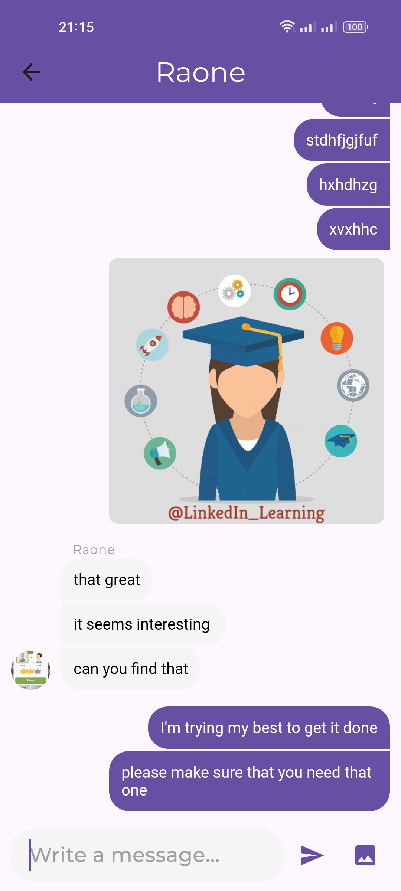
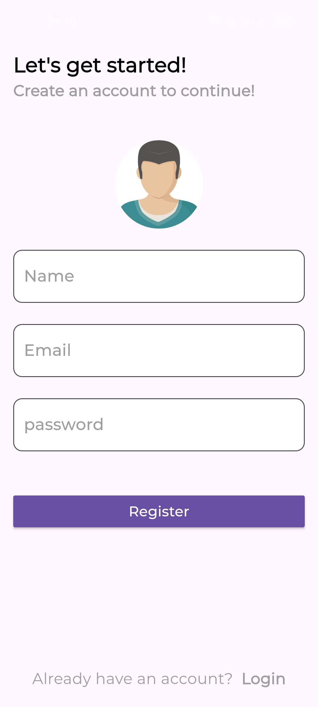

# Chat Application

This is a simple chat application where users can register, log in, and chat with each other. This project is a practice project for using Firebase and Flutter.

## Features

- User Registration
- User Login
- Real-time Chatting
- Profile Picture Upload
- Read Receipts
- Audio and Video Calls

## Screenshots






## Installation

1. **Clone the repository:**

   ```sh
   git clone https://github.com/yourusername/chatting.git
   cd chatting
